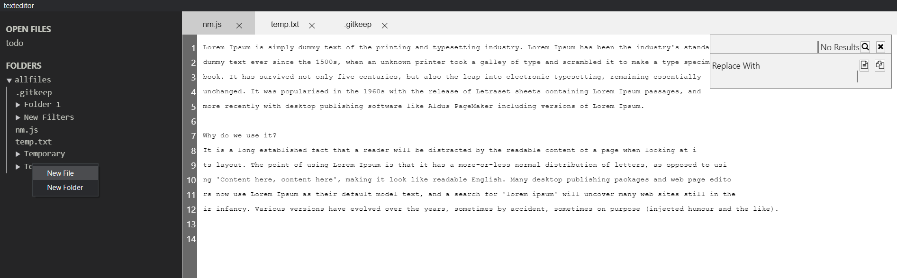
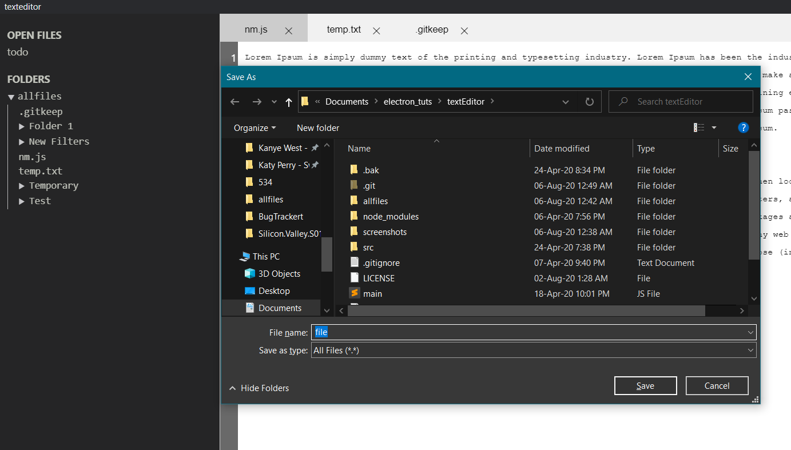

Electro-Editor
======

A custom text-editor made with ElectronJS and HTML that uses in-memory Piece Table.

## Features Implemented
* Undo & Redo
* Copy & Paste
* Find & Replace
* File Backup
* Automatic Reload

## Todo
* Git functionality
* In-app Terminal

## Screenshots






## To run

 ```
 git clone https://github.com/pranavg000/ElectronJs-Project.git
 cd ElectronJs-Project/
 npm start
 ```
